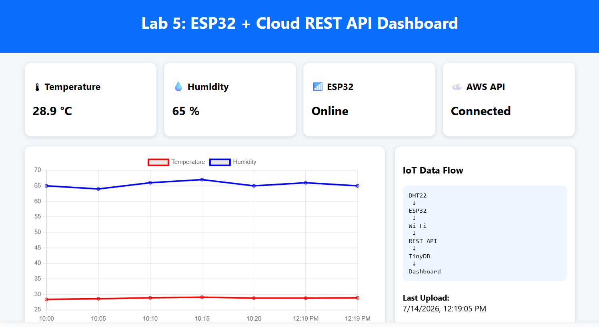
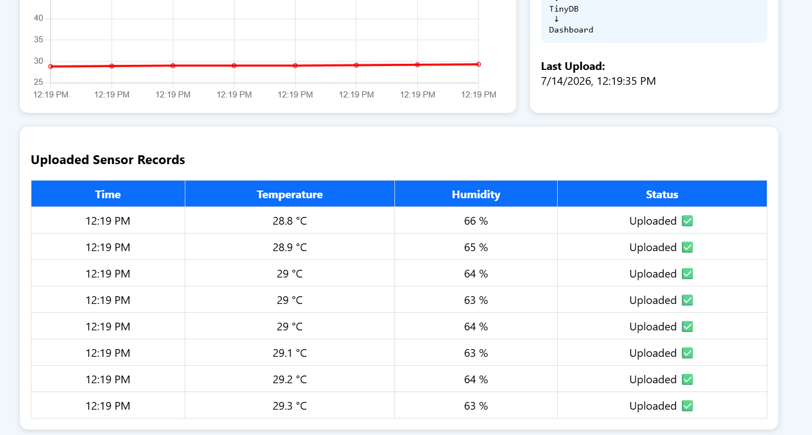

# Lab 5: Integrating ESP32 Sensor Data with Cloud-Based REST API and Dashboard Visualization

## 📌 Objectives

- Interface the **DHT11/DHT22** temperature and humidity sensor with the **ESP32/ESP8266**.
- Read and display sensor data on the Arduino Serial Monitor.
- Review the REST API developed and deployed on the AWS EC2 instance in **Lab 2**.
- Transmit sensor data from the ESP32 to the cloud using the REST API over the EC2 instance's public IPv4 address.
- Store uploaded sensor data in the cloud database.
- Retrieve stored sensor data through the REST API.
- Visualize real-time and historical sensor data using the dashboard developed in **Lab 3**.
- Understand the complete IoT data flow from an edge device to cloud storage and visualization.

---

# 📖 Background Theory

## ESP32 Microcontroller

The ESP32 is a low-cost, low-power microcontroller with built-in Wi-Fi and Bluetooth capabilities. It is widely used in IoT applications due to its processing power, wireless connectivity, and compatibility with numerous sensors.

## DHT11/DHT22 Temperature and Humidity Sensor

The DHT11 and DHT22 are digital sensors capable of measuring temperature and humidity. The DHT22 provides higher accuracy and a wider measurement range compared to the DHT11, making it suitable for more precise IoT applications.

## Sensor Data Acquisition

Sensor data acquisition is the process of collecting physical measurements from sensors and converting them into digital values that can be processed by microcontrollers and transmitted to cloud platforms.

## Serial Communication

Serial communication enables the ESP32 to transmit sensor readings to a computer through the USB interface. The Arduino Serial Monitor is commonly used for debugging and verifying sensor values before cloud integration.

## REST API Communication

A REST API allows IoT devices to communicate with cloud servers using standard HTTP requests. In this lab, the ESP32 sends sensor readings to the REST API developed in **Lab 2**.

## HTTP POST and GET Methods

- **POST** is used to upload temperature and humidity readings to the cloud.
- **GET** is used to retrieve previously stored sensor data.

## Cloud Data Storage on AWS EC2

The REST API hosted on an AWS EC2 instance stores incoming sensor data in a cloud database (TinyDB). This enables persistent storage and remote access to IoT sensor information.

## API Integration with Embedded Systems

Embedded systems such as the ESP32 use HTTP client libraries to communicate with REST APIs. This integration enables real-time data transmission from physical devices to cloud-based applications.

## IoT Data Flow

The complete IoT workflow includes:

```
DHT Sensor
      │
      ▼
ESP32 Microcontroller
      │
      ▼
Wi-Fi Network
      │
      ▼
REST API (AWS EC2)
      │
      ▼
TinyDB Database
      │
      ▼
Dashboard Visualization
```

## Dashboard-Based Data Visualization

The dashboard developed in **Lab 3** retrieves stored sensor data from the REST API and displays interactive charts, statistics, and historical records for monitoring environmental conditions.

---

# 🛠 Requirements

### Hardware

- ESP32 or ESP8266
- DHT11 or DHT22 Sensor
- Breadboard
- Jumper Wires
- USB Cable

### Software

- Arduino IDE
- ESP32 Board Package
- DHT Sensor Library
- WiFi Library
- HTTPClient Library
- AWS EC2 Instance
- FastAPI REST API (Lab 2)
- Dashboard (Lab 3)

---

# 🚀 Procedure

## Step 1: Connect the Hardware

Connect the DHT sensor to the ESP32.

| DHT Pin | ESP32 Pin |
|---------|-----------|
| VCC | 3.3V |
| DATA | GPIO 4 |
| GND | GND |

---

## Step 2: Install Required Libraries

Install the following libraries in the Arduino IDE:

- DHT Sensor Library
- Adafruit Unified Sensor
- WiFi
- HTTPClient

---

## Step 3: Configure Wi-Fi

Update the following values in the Arduino sketch:

```cpp
const char* ssid = "Your_WiFi_Name";
const char* password = "Your_WiFi_Password";
```

---

## Step 4: Configure the REST API Endpoint

Replace the server URL with your EC2 public IPv4 address.

Example:

```cpp
http://<EC2-Public-IP>:8000/sensor
```

---

## Step 5: Upload the Arduino Program

Compile and upload the sketch to the ESP32.

Open the **Serial Monitor**.

Verify that:

- Wi-Fi connects successfully.
- Temperature is displayed.
- Humidity is displayed.
- HTTP response code is 200.

---

## Step 6: Verify Cloud Storage

Open:

```
http://<EC2-Public-IP>:8000/sensor
```

Confirm that the uploaded sensor readings are stored in the cloud database.

---

## Step 7: Open the Dashboard

Visit:

```
http://<EC2-Public-IP>
```

Verify:

- Temperature chart updates.
- Humidity chart updates.
- Historical records are displayed.
- Latest sensor values are shown.

---

# 📂 Project Structure

```text
Lab-5/
│
├── README.md
├── esp32/
│   └── esp32_sensor_upload.ino
├── api/
│   └── main.py
├── dashboard/
│   ├── index.html
│   ├── style.css
│   └── script.js
├── screenshots/
│   ├── circuit.jpg
│   ├── serial-monitor.png
│   ├── wifi-connected.png
│   ├── api-response.png
│   ├── database.png
│   ├── dashboard.png
│   ├── temperature-chart.png
│   └── humidity-chart.png
└── images/
```

---

# 🔄 IoT Data Flow

```text
DHT11/DHT22 Sensor
        │
        ▼
ESP32 Microcontroller
        │
        ▼
Wi-Fi Network
        │
        ▼
AWS EC2 REST API
        │
        ▼
TinyDB Database
        │
        ▼
FastAPI GET Endpoint
        │
        ▼
Dashboard (Charts & Graphs)
```

---

# 📸 Output



# 📊 Sample Sensor Data

| Timestamp | Temperature (°C) | Humidity (%) |
|-----------|-----------------:|-------------:|
| 10:00 AM | 28.4 | 65 |
| 10:05 AM | 28.6 | 64 |
| 10:10 AM | 28.9 | 66 |
| 10:15 AM | 29.1 | 67 |

---

# ✅ Result

- Successfully interfaced the DHT11/DHT22 sensor with the ESP32.
- Displayed sensor readings on the Serial Monitor.
- Connected the ESP32 to a Wi-Fi network.
- Uploaded temperature and humidity data to the REST API hosted on AWS EC2.
- Stored sensor readings in the cloud database.
- Retrieved stored data using the REST API.
- Visualized real-time and historical sensor data on the web dashboard.
- Verified the complete end-to-end IoT data flow from sensor acquisition to cloud visualization.

---

# 🎯 Conclusion

This lab demonstrated a complete cloud-enabled IoT system by integrating an ESP32 microcontroller with a DHT11/DHT22 sensor, a REST API hosted on AWS EC2, cloud-based data storage, and an interactive dashboard. Sensor readings were successfully collected, transmitted over Wi-Fi, stored in the cloud, and visualized through graphical dashboards. The experiment provided practical experience in embedded systems, RESTful communication, cloud computing, and real-time IoT data visualization, illustrating the full lifecycle of IoT data from acquisition to analysis.

---

